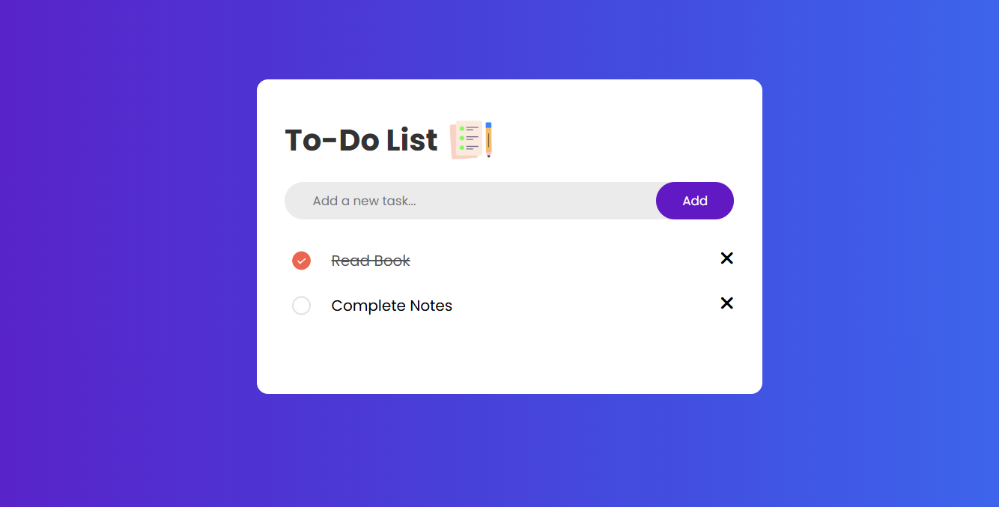

# 📝 To-Do List Web App

A simple and responsive To-Do List application built using **HTML**, **CSS**, and **JavaScript**. This app allows users to add, delete, and mark tasks as completed. The task list is saved in the browser's **localStorage**, so your tasks persist even after refreshing the page.

## 📸 Preview

## 🚀 Features

- ✅ Add new tasks
- ❌ Delete individual tasks
- ✔️ Mark tasks as completed (click to toggle)
- 💾 Automatically saves tasks to localStorage
- 🎨 Simple and clean user interface

## 🔧 Technologies Used

- HTML5
- CSS3
- JavaScript (ES6)
- [Font Awesome](https://fontawesome.com/) for icons
